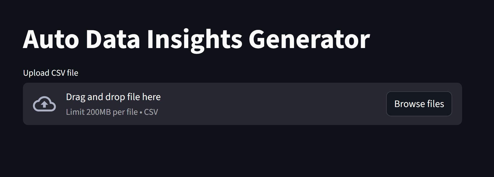
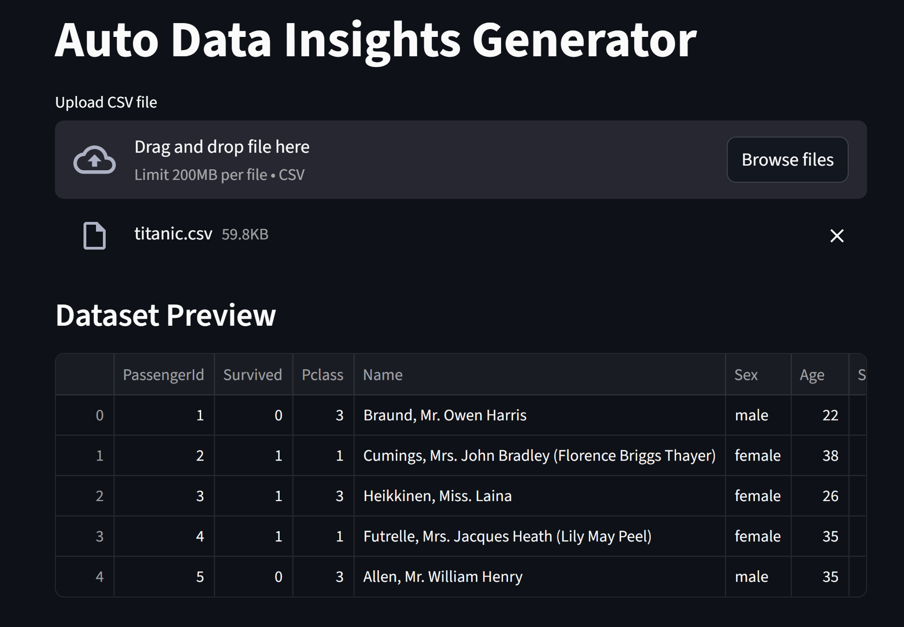
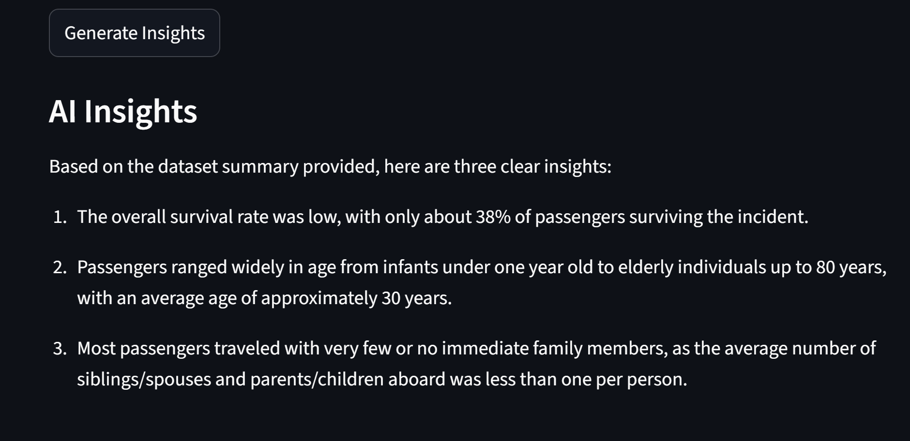

# Auto Data Insights Generator

## Table of Contents

- [Overview](#overview)
- [Objective](#objective)
- [Features](#features)
- [Tech Stack](#tech-stack)
- [How It Works](#how-it-works)
- [Project Structure](#project-structure)
- [Sample Output](#sample-output)
- [How to Run Locally](#how-to-run-locally)
- [Deployment](#deployment)
- [Challenges Faced](#challenges-faced)
- [Future Improvements](#future-improvements)
- [Author](#author)

## Overview
The **Auto Data Insights Generator** is a data analytics tool that automatically converts raw dataset statistics into meaningful, human-readable insights using AI.

This project leverages **Hugging Face Inference API** and **DeepSeek LLM** to simulate how a data analyst interprets data and presents insights.

---

## Objective
To automate the process of data analysis by:
- Extracting statistical summaries from datasets
- Generating clear and concise insights using AI
- Reducing manual effort for analysts

---

## Features
- Upload CSV datasets
- Automatic statistical analysis (mean, max, min)
- AI-generated insights in simple English
- Fast inference using Hugging Face API
- Interactive web interface using Gradio

---

## Tech Stack
- **Python**
- **Pandas** – Data processing
- **Streamlit** – User interface
- **Hugging Face Router API**
- **DeepSeek LLM** – Insight generation

---

## How It Works
1. User uploads a CSV dataset
2. The system:
   - Extracts numerical columns
   - Computes key statistics (mean, max, min)
3. A structured prompt is created
4. The prompt is sent to the AI model (DeepSeek via Hugging Face)
5. The model returns 3 clear insights
6. Insights are displayed in the UI

---

## Project Structure
<pre>
auto-data-insights-generator/
│
├── app.py
├── requirements.txt
├── README.md
├── .gitignore
</pre>
---

## Sample Output

### Upload Dataset

### Dataset Preview

### AI Generated Insights

## How to Run Locally

1. Clone the repository: <pre>
git clone https://github.com/Ajoy-Jayarajan/auto-data-insights-generator.git 
cd auto-data-insights-generator </pre>

2. Create virtual environment:<pre>
python -m venv venv
venv\Scripts\activate</pre>

3. Install dependencies: <pre>
pip install -r requirements.txt </pre>

4. Create a .env file in the project root: <pre>
HF_TOKEN=your_huggingface_token_here </pre>

5. Run the app: <pre>
python -m streamlit run app.py</pre>

## Deployment
This project is deployed using Hugging Face Spaces (Gradio SDK).  
Live Demo: https://huggingface.co/spaces/ajoy-jayarajan/auto-data-insights-generator

## Challenges Faced
- Library compatibility issues (protobuf conflicts)
- Handling messy CSV files (encoding & parsing errors)
- Model performance limitations (local vs API inference)
- API authentication and permission errors
- Handling inconsistent API responses

## Future Improvements
- Add data visualizations (charts)
- Support for multiple file formats (Excel, JSON)
- Advanced anomaly detection
- Downloadable reports
- Dashboard-style insights

## Author
Ajoy Jayarajan  
Student | Data Analytics & AI Enthusiast
